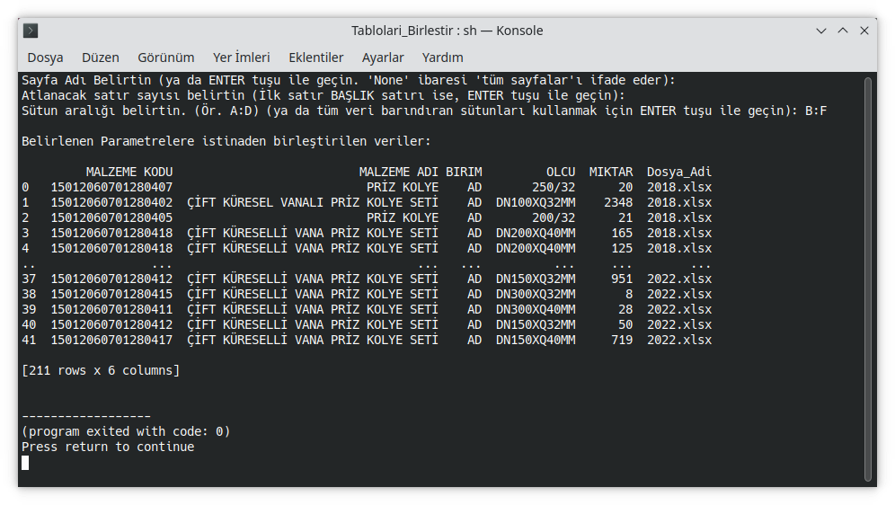

# Birlestir
Aynı klasörde bulunan Excel Hesap tablosu verilerini birleştiren python kodu.
Tüm dosya içerikleri birleştirildikten sonsa "TUMU.xlsx" adında yeni bir dosyaya kaydedilir.
Python Kodunun çalışması için bilgisayarınızda "Pandas" ve "openpyxl" kütüphanelerinin / modüllerinin yüklü olması gerekir.

## Ekran Görüntüsü
