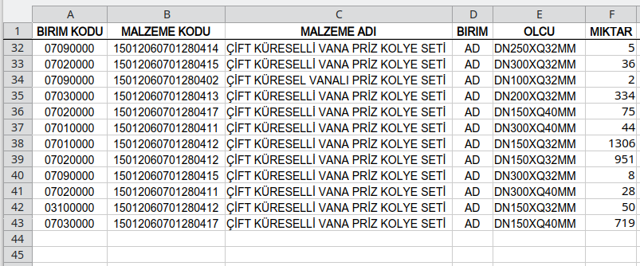
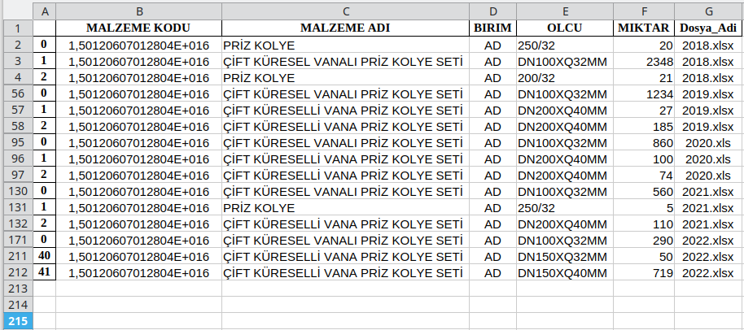

# Excel Dosyalarını Birlestir (Merge Excel Files)
Python dosyası ile aynı klasörde bulunan Excel formatlı (**.xls, .xlsx**) tüm dosya verilerini, belirtilen parametrelere göre birleştiren python kodu.
Tüm dosya içerikleri birleştirildikten sonsa "**TUMU.xlsx**" adında yeni bir dosyaya kaydedilir.
Python Kodunun doğru çalışması için bilgisayarınızda "**Pandas**" ve "**openpyxl**" kütüphanelerinin / modüllerinin yüklü olması gerekir.

## Örnek Excel Dosyaları
Örnek Excel dosyalarının içeriklerine dair ekran görüntüleri aşağıdadır;

### 2018.xlsx dosya içeriği

### 2019.xlsx dosya içeriği

### 2022.xlsx dosya içeriği

## Kodu Çalıştır
* Kod çalıştırıldıktan sonra sorulan parametre bilgileri yazılır ya da parametre yazmak istenmiyorsa **ENTER** tuşuna basılarak ilgili parametre geçilir (boş bırakılır) . Bu durumda her bir parametre için belirlenmiş olan varsayılan değerler kullanılır.
* Ardından belirlenen parametrelere göre dosya verileri okunarak yeni bir dosyada birleştirilere kaydedilir.
* Birleştirme işlemine ait veriler, konsol ekranında da görüntülenir.

## Koda ait Ekran Görüntüsü

### TUMU.xlsx dosya içeriği
Excel dosyalarındaki verilerin birleştirilmesi sonucu elde edilen **TUMU.xlsx** dosyasının içeriğine dair ekran görüntüsü;

(**Not:** Dosya isimleri ve  içeriklerinin tamamının görünmesi amacıyla bazı sütunlar gizlenerek ekran görüntüsü alınmıştır.)

### NOT
Dikkat ettiyseniz en sağdaki Sütuna, birleştirme işlemi sonrası, verilerin hangi dosyadan alındığına dair bilgi de eklendi. 

Bu bilgi, sorun yaşanması halinde sorunun hangi dosyadan kaynaklandığının tespit edilebilmesi adına faydalı olacağı düşüncesi ile eklenmiştir.